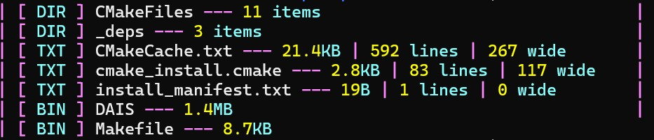
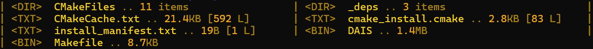
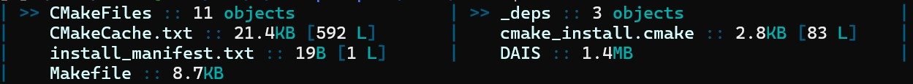
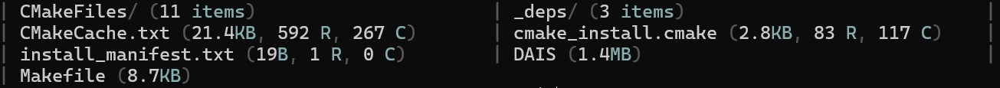

# &lt; DATA / AI SHELL >
## ... [<span style="color:#ff00ff">-</span>] DAIS

 [](https://mitro54.github.io/DAIS/coverage/)

**DAIS** is a **PTY (pseudoterminal) shell wrapper** for **Data / AI Engineers**. Core is written in **C++**, that supports **Python** scripts as extensions. 

### The Mission
To create a helpful open source tool that allows users to quickly **gather metadata** about the files in a directory or **query databases**, all with **minimal configuration** or external commands. 

---

> ### Imagine a better workflow:
> * How about a standard `ls` command whose output is fully configurable and sorted by user in any meaningful way? 
> * How about running the exact same commands on ssh connections, allowing you to scout remote unknown systems or query their databases with the same ease? 
> * Don't like the way things look? Make them look just the way you want them to.

---

### Visual Customization
DAIS allows you to style your file listing exactly how you want it; from minimal layouts to rich, colorful themes or even icon-enhanced displays. Here are some pre-configured examples:

**Neon Style** (High Contrast & Vibrant)


**Amber Retro** (Classic Terminal Feel)


**Deep Sea** (Professional Dark Theme)


**Icon Enhanced** (Informative / Visual)


**Basic / Minimalist** (Clean & Simple)


## Under the Hood: Features
Beyond the visuals, DAIS is built for performance and extensibility.

- **Near Zero-Latency PTY**: Seamless shell wrapping with native C++ performance.
- **Python Plugin System**: Extend functionality using standard Python scripts
- **Advanced Database Querying**: 
    - **Multi-Engine**: Supports **Postgres**, **MySQL**, **SQLite**, and **DuckDB**.
    - **Zero-Config**: Recursive `.env` discovery & System Environment fallback.
    - **Enterprise-Safe Package Management**: Automatically creates and manages isolated **Python Virtual Environments** (`.venv`) for database drivers, ensuring no pollution of the system Python.
    - **Project-Root Anchoring**: Intelligently anchors virtual environments to your project's `.env` location (Project Root).
    - **Hardened Security**: Uses **Base64-encoded SQL proxying** to eliminate shell injection vulnerabilities during remote execution.
    - **Persistence**: Full DDL/DML support (Autocommit enabled) for table creation and updates.
- **Smart `ls` Command**:
    - **Adaptive Performance**: Uses parallel processing for accelerated analysis of large directories
    - **Data-Aware**: Automatically detects CSV/TSV/JSON files and displays column counts
    - **Text Insights**: Shows line counts and max line width for code/text files
    - **Configurable Sorting**: Sort output by name, size, type, or row count (`:ls size desc`)
    - **Remote Acceleration**: transparently injects a lightweight static binary agent into SSH sessions for high-performance remote listing
    - **Fully Configurable**: Define your own output templates, icons, and colors, from config.py
    - **Flexible Usage**: Styling applies seamlessly to `ls -a` (hidden files) and `ls /absolute/path`
- **Seamless SSH Integration**:
    - **Remote History Sync**: Internal DAIS commands (`:db`, `:ls`) executed in SSH sessions are injected into the remote shell's history.
    - **Agent Auto-Deploy**: Automatically detects remote architecture (x86_64, ARM64, ARMv7) and deploys the correct optimized agent. Falls back to a universal Python script if the specialized agent cannot run.
- **Compatibility**:
    - **Configurable Prompt Detection**: Automatically handles complex prompts (multi-line, colored, autosuggestions), supporting most standard prompts out-of-box, adjustable for anything else via config
    - **Shell Support**: 
        - **Bash**, **Ash**, **Zsh**: Full support including DAIS visual history navigation and command editing in ssh & locally
        - **Fish**: Native shell experience takes precedence (DAIS visual mode disabled to respect Fish's advanced autosuggestions; doesnt save DAIS commands to history)
    - **Shell-Ready**: Handles special filenames (spaces, quotes, emojis) correctly
    - **Robust CI**: Verified functional cross-platform (Ubuntu, macOS, Fedora).
- **Smart Interception**: DAIS commands only work at the shell prompt: vim, nano, and other apps run unaffected

### Runtime Commands

#### File Listing Configuration (`:ls`)
Configure how the `ls` command displays files. Arguments can be provided in any order, separated by spaces or commas.

**Parameters:**
- **Sort Field**: `name`, `size`, `type`, `rows`, `none`
- **Order**: `asc`, `desc`
- **Group Directories**: `true` (dirs first), `false` (mixed)
- **Flow Direction**: `h` (horizontal, default), `v` (vertical)
- **Reset**: `d` or `default` (reset to config defaults)

**Examples:**
| Command | Effect |
|---------|--------|
| `:ls` | Show current settings |
| `:ls size desc` | Sort by size, descending |
| `:ls type, asc` | Sort by type, ascending (comma separated) |
| `:ls v` | Use vertical flow (column-by-column) |
| `:ls false` | Disable "directories first" grouping |
| `:ls d` | Reset to defaults |
 

#### Database Querying (`:db`)
Execute SQL queries directly from the terminal. DAIS auto-detects credentials and **anchors them to your project root** (via `.env` discovery).

**Core Reliability:**
- **Zero-Pollution**: Installs drivers like `psycopg2` or `mysql-connector` into a private `.venv` managed by DAIS. 
- **Auto-Retry**: If a driver is missing, DAIS offers to set up the environment and re-runs your query automatically upon success.
- **PTY-Safe**: Handles raw terminal carriage returns and non-blocking prompts for a smooth SSH experience.

**Supported Engines:**
- **Postgres** & **MySQL** (Requires `.env` or system env vars)
- **SQLite** & **DuckDB** (File-based or in-memory)

**Syntax:**
`:db <SQL Query> [flags]` or `:db <Saved Query Alias>`

**Flags:**
These flags can be placed anywhere in the command:
- `--json`: Export output as JSON
- `--csv`: Export output as CSV 
- `--output <file>`: Save result directly to file (bypasses terminal)
- `--no-limit`: Remove the default 1000-row Safety Limit

**Examples:**
```bash
# Basic query (Table View)
:db SELECT * FROM users

# Run Update/Create (Persisted via Autocommit)
:db CREATE TABLE test (id INT, val TEXT)

# Export to JSON
:db SELECT * FROM logs WHERE level='ERROR' --json

# Save large report to CSV
:db SELECT * FROM transactions --csv --output report.csv
```

#### History & System
| Command | Description |
|---------|-------------|
| `:history` | Show last 20 commands |
| `:history n` | Show last n commands |
| `:history clear` | Clear command history |
| `:help` | Show all available commands |
| `:q` or `:exit` | Exit DAIS |
| `:agent-status` | Check agent status in remote sessions |

### Command History
DAIS maintains its own file-based history (~/.dais_history) separate from your shell's history.
- **Smart Navigation**: Use UP/DOWN arrows at an empty prompt to navigate DAIS history.
- **Original Commands**: Saves exactly what you typed (e.g., `ls`, including the projects own runtime : commands).
- **Context Aware**: Arrow keys only navigate history when the shell is idle; they work normally inside apps like vim or nano.
- **Remote Persistence**: When using SSH, DAIS injects its commands into the *remote* shell's history (using `history -s` or `print -s`), ensuring a unified experience across local and remote sessions.

## Build
The project has been tested on **Ubuntu 24.04**, **Debian 13**, **Fedora 40**, **Arch Linux**, **Alpine 3.20**, and **macOS**.

### 1. Install dependencies
Choose your operating system:
- **Docker** does not need `sudo`, try the commands without it if the command fails
- Make sure your **g++ version is at least 13** to support **C++20**

#### Ubuntu 24.04 LTS and Debian 13
- `sudo apt update`
- `sudo apt install build-essential cmake python3-dev git`

#### Fedora 40
- `sudo dnf install gcc-c++ cmake make python3-devel git`

#### Arch Linux
- `sudo pacman -Sy base-devel cmake python git`

#### Alpine Linux
- `sudo apk add build-base cmake python3-dev git`

#### macOS
- `xcode-select --install`
- `brew install cmake python`

### 2. Clone the repo and cd in to it
- `git clone https://github.com/mitro54/DAIS.git`
- `cd DAIS`

### 3. Create a build folder and cd in to it
- `mkdir build`
- `cd build`

### 4. Run cmake and make
- `cmake ..` or `cmake -DCMAKE_CXX_COMPILER=g++-13 ..` if you have issues with g++ version
- `make`

### 4.1 (Optional) Install the DAIS command system-wide
`sudo make install`, this allows you to run this project with `DAIS` from anywhere in terminal!

### 5. Run it (if you did not do 4.1)
`./DAIS`

## Testing

DAIS includes automated tests for both core logic and interactive CLI flows.

### Run Tests Locally

**1. Basic Functionality:**
Verifies build integrity and core commands (requires `pexpect`).
```bash
./tests/test_build.sh
pip install pexpect
python3 tests/functional/test_commands.py
```

**2. Full Database CI Simulation (Recommended):**
Runs the full suite against real **Postgres** and **MySQL** instances using Docker.
```bash
# Requires Docker
bash shell_scripts/test_local.sh
```

**3. Coverage Report:**
Generate HTML coverage reports for Python extensions.
```bash
bash shell_scripts/generate_coverage.sh
```

### CI Pipeline
DAIS uses GitHub Actions for cross-platform verification:
- **Matrix**: Ubuntu, macOS, Fedora, Debian, Alpine, Arch.
- **Service Containers**: Automated Postgres 15/MySQL 8 testing.
- **Strict Mode**: Enforces 100% database adapter presence in CI.

Available Dockerfiles: `ubuntu-24.04`, `debian-13`, `fedora-40`, `arch`, `alpine-3.20`